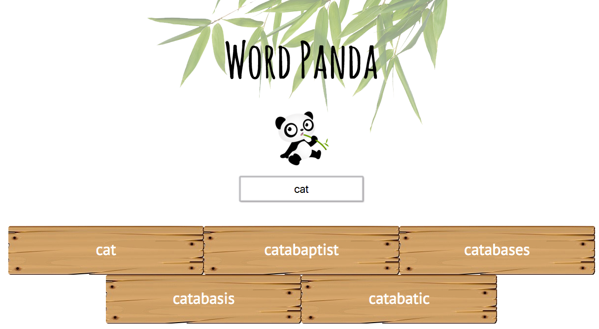
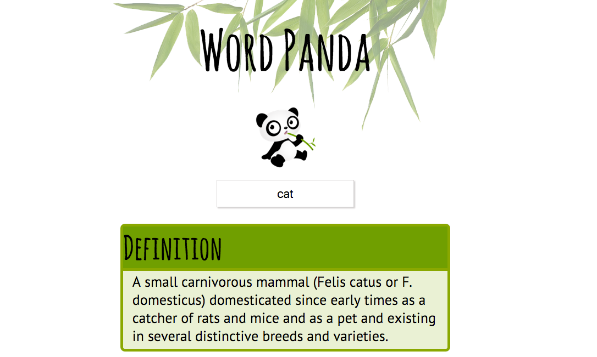
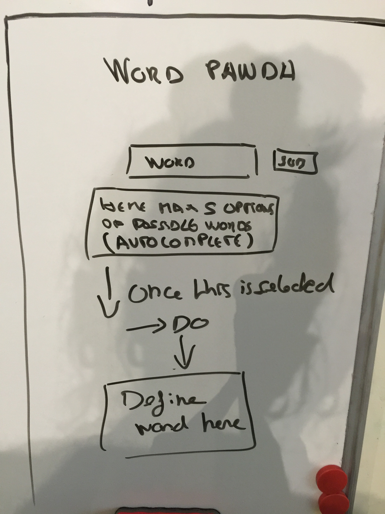
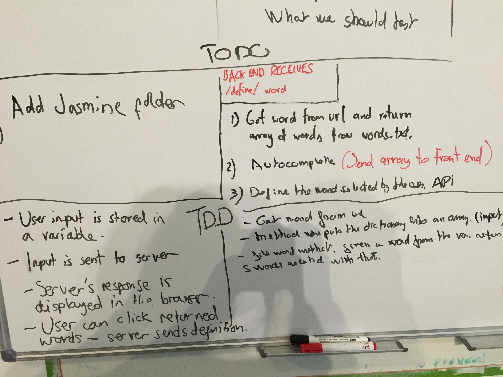
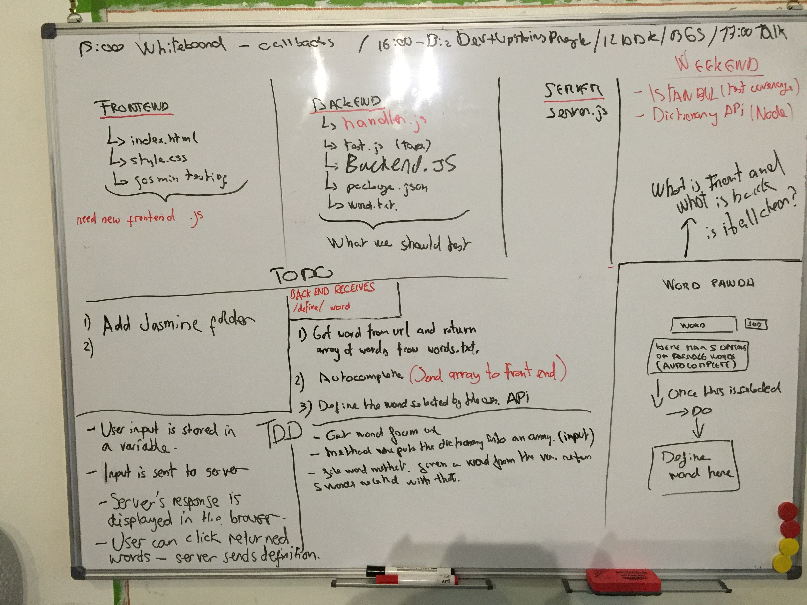

# Word Panda


[](https://codecov.io/github/olot/wordpanda?branch=master)
[](https://david-dm.org/olot/wordpanda)
[](https://david-dm.org/oloy/wordpanda#info=devDependencies)


## What is Word Panda
This application uses a dictionary ```API``` to get the definition for any word that the user wants to type in.   
This is how Word Panda application looks like:


The user can type in any word, only typing three letters the user will get five suggested words.



When the user click to any of the suggested words it will show the corresponding definition for that word.




## How
This project it is done using TDD. We also use ```Node.js``` and a
dictionary ```API``` to get the definitions.  

FontEnd testing is done using ```Jasmine```, and for the backend testing is used ```TAPE```. This application is also covered with ```Istanbul```, our goal is to reach 90% of test coverage.

This application is deployed on ```Heroku``` see [here](https://word-panda.herokuapp.com/).


#### Our sketch








## Stretch goals

* [Voice driven web apps](https://developers.google.com/web/updates/2013/01/Voice-Driven-Web-Apps-Introduction-to-the-Web-Speech-API?hl=en)

* [Facebook API](https://developers.facebook.com/docs/apis-and-sdks)

* [Twitter API](https://dev.twitter.com/rest/public)

## References

* [Heroku](https://devcenter.heroku.com/articles/getting-started-with-nodejs#view-logs)

* [Dictionary API](http://developer.wordnik.com/)

* [Jasmin](http://jasmine.github.io/)

* [Istanbul](https://github.com/gotwarlost/istanbul)

* [Repo badges](https://github.com/dwyl/repo-badges)

* [Node.js](https://nodejs.org/en/)
